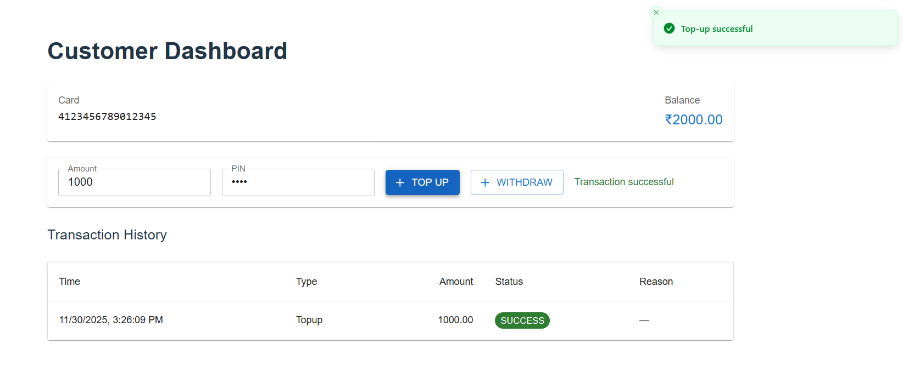
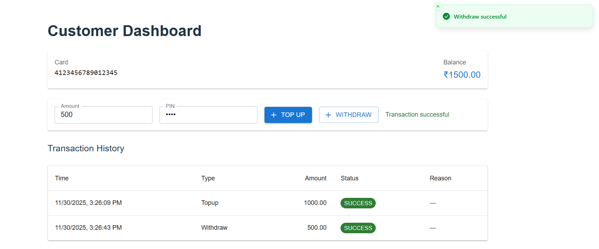
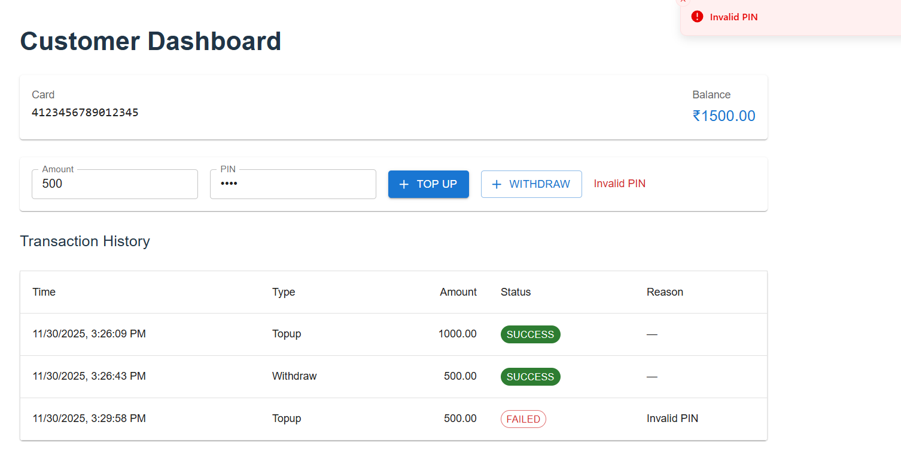
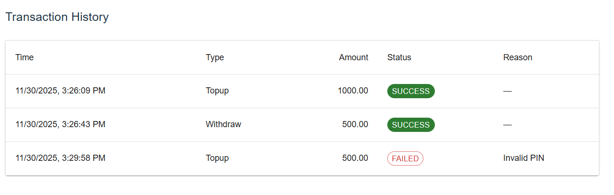
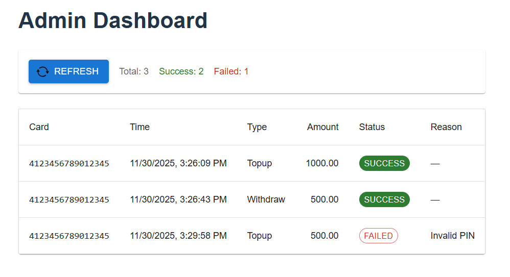

# 💳 Banking System POC — PayTabs Global Assignment

A production-style Proof of Concept (POC) banking system designed according to the PayTabs Global Assignment specifications.
This project demonstrates clean microservice separation, secure transaction processing, role-based dashboards, and SHA-256 PIN authentication.

---

# 🌐 System Overview

This project simulates a two-tier banking workflow:

1. **System 1 — API Gateway (Port 8081)**
   Validates incoming requests, enforces card-range rules, and forwards valid transactions to System 2.
2. **System 2 — Core Banking Processor (Port 8082)**
   Processes transactions, verifies PINs (SHA-256 hashed), updates balances, and logs all activity.
3. **Banking UI — React Frontend**
   Provides dashboards for **Customer** and **Admin** roles.

---

# 📁 Project Structure

```
banking-system-poc/
├── system1-gateway/        # Microservice 1 — Entry Gateway (Spring Boot, 8081)
├── system2-corebank/       # Microservice 2 — Core Bank Engine (Spring Boot, 8082)
└── banking-ui/             # React.js Frontend (Vite + TypeScript)
```

---

# 🚀 Features

### 🔹 System 1 — API Gateway

- Acts as the **single entry point** for all transactions.
- Validates:
  - Card number presence
  - **Card range → must start with 4**
  - PIN presence
  - Positive amount
  - Transaction type (`topup | withdraw`)
- Forwards valid requests to System 2 using `RestTemplate`.

### 🔹 System 2 — Core Banking

- Maintains in-memory **Cards** and **Transactions** in H2.
- Secure PIN hashing using **SHA-256**.
- Automatically seeds one customer card.
- Processes:
  - **Top-up**
  - **Withdraw** (with insufficient balance checks)
- Returns detailed responses including:
  - Status (`SUCCESS | FAILED`)
  - Reason (`Invalid PIN`, `Insufficient balance`, etc.)

### 🔹 Frontend (React + TypeScript)

- **Customer Dashboard**
  - View current balance
  - View transaction history
  - Perform top-up / withdraw
- **Admin Dashboard**
  - View all transactions across the system
- **Role-based routing** using sessionStorage
- Clean Material-UI based interface

---

# 🛠️ Tech Stack

### Backend

- Java 17
- Spring Boot 3
- Spring Web
- Spring Security
- Spring Data JPA
- H2 Database
- Maven

### Frontend

- React.js (Vite + TypeScript)
- Axios
- React Router
- Material-UI

---

# ⚙️ Setup Instructions

## 1️⃣ Clone the Repository

```bash
git clone https://github.com/<your-username>/banking-system-poc.git
cd banking-system-poc
```

---

## 2️⃣ Start System 2 — CoreBank (Port 8082)

```bash
cd system2-corebank
mvn spring-boot:run
```

### ✅ Auto-Seeded Test Card

| Field            | Value                |
| :--------------- | :------------------- |
| Card Number      | **4123456789012345** |
| PIN              | **1234**             |
| Starting Balance | **1000**             |

---

## 3️⃣ Start System 1 — Gateway (Port 8081)

```bash
cd system1-gateway
mvn spring-boot:run
```

---

## 4️⃣ Start the React UI

```bash
cd banking-ui
npm install
npm run dev
```

Access the app:
👉 **[http://localhost:5173](http://localhost:5173)**

---

# 🔑 Login Credentials

| Role     | Username | Password |
| :------- | :------- | :------- |
| Customer | `cust1`  | `pass`   |
| Admin    | `admin`  | `admin`  |

---

# 📡 API Endpoints

## ⭐ System 1 — Gateway (8081)

| Method | Endpoint       | Purpose                                  |
| :----- | :------------- | :--------------------------------------- |
| POST   | `/transaction` | Validate \& forward transaction requests |

---

## ⭐ System 2 — CoreBank (8082)

| Method | Endpoint                    | Purpose                           |
| :----- | :-------------------------- | :-------------------------------- |
| POST   | `/process`                  | Internal transaction processor    |
| GET    | `/balance?cardNumber=`      | Get card balance                  |
| GET    | `/transactions?cardNumber=` | Customer transaction history      |
| GET    | `/transactions/all`         | Admin-level full transaction list |

---

# 🧪 cURL Testing Examples

### 🔹 Top-up Transaction

```bash
curl -X POST http://localhost:8081/transaction \
  -H "Content-Type: application/json" \
  -d '{
    "cardNumber": "4123456789012345",
    "pin": "1234",
    "amount": 500,
    "type": "topup"
  }'


```



### 🔹 Withdraw Transaction

```bash
curl -X POST http://localhost:8081/transaction \
  -H "Content-Type: application/json" \
  -d '{
    "cardNumber": "4123456789012345",
    "pin": "1234",
    "amount": 200,
    "type": "withdraw"
  }'

```



### 🔹 Invalid PIN Example

```bash
curl -X POST http://localhost:8081/transaction \
  -H "Content-Type: application/json" \
  -d '{
    "cardNumber": "4123456789012345",
    "pin": "9999",
    "amount": 100,
    "type": "withdraw"
  }'
```



### 🔹 Fetch Balance

```bash
curl "http://localhost:8082/balance?cardNumber=4123456789012345"
```

### 🔹 Customer Transaction History

```bash
curl "http://localhost:8082/transactions?cardNumber=4123456789012345"
```



### 🔹 Admin — All Transactions

```bash
curl "http://localhost:8082/transactions/all"
```

## 

# 🗄️ H2 Database Console

Access URL:

```
http://localhost:8082/h2-console
```

---

### Customer Dashboard

_View balance, history, and perform transactions._

### Admin Dashboard

_Monitor all system transactions in real-time._

---

# 📌 Notes

- PINs are **never stored in plain text**.
- All system validations occur in **System 1**.
- All business logic \& data storage occurs in **System 2**.
- Frontend interacts with System 1 for transactions, and System 2 for read-only data.

---

# 👨‍💻 Author

**Kasukurthi Bhargav Sri Ram** -
Java Full Stack Developer
