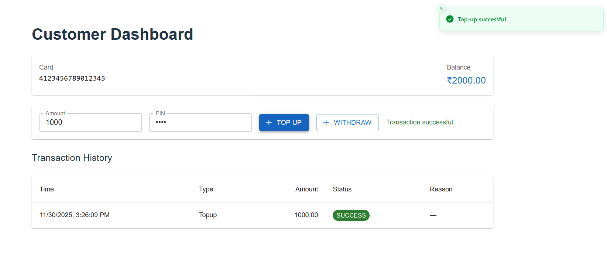
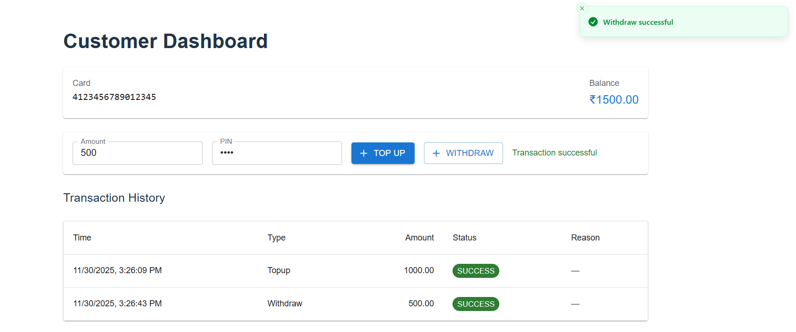

# 💳 Banking System POC — PayTabs Global Assignment

A production-style Proof of Concept (POC) banking system designed according to the PayTabs Global Assignment specifications.[^1]
This project demonstrates clean microservice separation, secure transaction processing, role-based dashboards, and SHA-256 PIN authentication.[^10]

---

# 🌐 System Overview

This project simulates a two-tier banking workflow that mirrors a simple card-based banking flow.[^10]

1. **System 1 — API Gateway (Port 8081)**
   Validates incoming requests, enforces card-range rules, and forwards valid transactions to System 2.[^10]
2. **System 2 — Core Banking Processor (Port 8082)**
   Processes transactions, verifies PINs using SHA-256 hashing, updates balances, and logs all activity.[^10]
3. **Banking UI — React Frontend**
   Provides dashboards for **Customer** and **Admin** roles, calling the backend services via REST APIs.[^10]

---

# 📡 Quick API \& cURL Reference

## System 1 — Gateway (https://banking-system-poc.onrender.com)

| Method | Endpoint       | Purpose                                  |
| :----- | :------------- | :--------------------------------------- |
| POST   | `/transaction` | Validate and forward transaction request |

### Example: Top-up via Gateway

```bash
curl -X POST https://banking-system-poc.onrender.com/transaction \
  -H "Content-Type: application/json" \
  -d '{
    "cardNumber": "4123456789012345",
    "pin": "1234",
    "amount": 500,
    "type": "topup"
  }'
```

## 

## System 2 — CoreBank (https://system2-corebank.onrender.com)

| Method | Endpoint                    | Purpose                           |
| :----- | :-------------------------- | :-------------------------------- |
| POST   | `/process`                  | Internal transaction processor    |
| GET    | `/balance?cardNumber=`      | Get card balance                  |
| GET    | `/transactions?cardNumber=` | Customer transaction history      |
| GET    | `/transactions/all`         | Admin-level full transaction list |

### Example: Withdraw via Gateway (reaches System 2)

```bash
curl -X POST https://banking-system-poc.onrender.com/transaction \
  -H "Content-Type: application/json" \
  -d '{
    "cardNumber": "4123456789012345",
    "pin": "1234",
    "amount": 200,
    "type": "withdraw"
  }'
```



### Example: Invalid PIN

```bash
curl -X POST https://banking-system-poc.onrender.com/transaction \
  -H "Content-Type: application/json" \
  -d '{
    "cardNumber": "4123456789012345",
    "pin": "9999",
    "amount": 100,
    "type": "withdraw"
  }'
```


### Fetch Balance

```bash
curl "https://system2-corebank.onrender.com/balance?cardNumber=4123456789012345"
```

### Customer Transaction History

```bash
curl "https://system2-corebank.onrender.com/transactions?cardNumber=4123456789012345"
```


### Admin — All Transactions

```bash
curl "https://system2-corebank.onrender.com/transactions/all"
```

## 

# 📁 Project Structure

```text
banking-system-poc/
├── system1-gateway/        # Microservice 1 — Entry Gateway (Spring Boot, 8081)
├── system2-corebank/       # Microservice 2 — Core Bank Engine (Spring Boot, 8082)
└── banking-ui/             # React.js Frontend (Vite + TypeScript)
```

System 1 and System 2 follow a simple microservices-style separation where the gateway focuses on validation and routing, while the core service owns data and business rules.[^10]

---

# 🚀 Features

### 🔹 System 1 — API Gateway

- Acts as the **single entry point** for all transactions from the UI or external clients.[^10]
- Validates:
  - Card number presence
  - **Card range → must start with 4**
  - PIN presence
  - Positive amount
  - Transaction type (`topup` or `withdraw`)
- Forwards valid requests to System 2 using an HTTP client.[^10]

### 🔹 System 2 — Core Banking

- Stores **Card** and **Transaction** data in an in-memory H2 database.[^11]
- Uses SHA-256 for secure PIN hashing and comparison, never storing plain text PINs.[^11]
- Seeds one default test card at startup with a balance of 1000 and PIN `1234`.[^11]
- Handles:
  - **Top-up**: increases card balance
  - **Withdraw**: checks available balance and decreases it if sufficient
- Records each request as a transaction with status and reason fields.[^11]

### 🔹 Frontend (React + TypeScript)

- **Customer Dashboard**
  - Shows current balance fetched from System 2.[attached_file:c26d1347-dcfa-410f-9593-f6aa52cc37df]
  - Displays customer’s transaction history.
  - Allows top-up and withdraw via System 1 `/transaction` API.
- **Admin Dashboard**
  - Lists all transactions using the `/transactions/all` endpoint.
- Uses simple role-based routing based on values stored in `sessionStorage` after login.[attached_file:118237a2-7887-44b9-a897-7b558bc38618]

---

# 🛠️ Tech Stack

### Backend

- Java 17
- Spring Boot 3
- Spring Web
- Spring Security (relaxed for POC but ready for future hardening)
- Spring Data JPA
- H2 Database
- Maven

### Frontend

- React.js with Vite + TypeScript
- Axios for API calls
- React Router for navigation
- Material-UI for basic styling and layout

These technologies align with the recommended stack for a simple but modern banking POC.[^10]

---

# ⚙️ Setup Instructions (Local)

## 1️⃣ Clone the Repository

```bash
git clone https://github.com/sriram1224/banking-system-poc.git
cd banking-system-poc
```

---

## 2️⃣ Start System 2 — CoreBank (Port 8082)

```bash
cd system2-corebank
mvn spring-boot:run
```

### ✅ Auto-Seeded Test Card

| Field            | Value                |
| :--------------- | :------------------- |
| Card Number      | **4123456789012345** |
| PIN              | **1234**             |
| Starting Balance | **1000**             |

---

## 3️⃣ Start System 1 — Gateway (Port 8081)

```bash
cd system1-gateway
mvn spring-boot:run
```

---

## 4️⃣ Start the React UI (Local Dev)

```bash
cd banking-ui
npm install
npm run dev
```

Local UI Dev URL:
👉 `http://localhost:5173`

Deployed UI URL (for this POC):
👉 `https://banking-system-poc-omega.vercel.app`[attached_file:4db61fc7-4070-4e37-bb3e-0ad0b7b479a5]

---

# 🔑 Login Credentials

| Role     | Username | Password |
| :------- | :------- | :------- |
| Customer | `cust1`  | `pass`   |
| Admin    | `admin`  | `admin`  |

The login is intentionally simple and hard-coded for this POC to keep focus on transaction flow rather than full authentication.[^10]

---

# 🗄️ H2 Database Console

When running System 2 locally, the in-memory H2 console is available at:

```text
http://localhost:8082/h2-console
```

You can use this console to inspect the `CARD` and `TRANSACTION` tables while testing.[^11]

---

### Customer Dashboard

_View balance, see transaction history, and perform top-up or withdraw actions from a simple, clean UI._

### Admin Dashboard

_Monitor all system transactions in real time, useful for auditing and verifying the POC behaviour._

(Replace the placeholder image names with the exported screenshots from the deployed UI if needed, keeping the same Markdown image lines already present.)

---

# 📌 Notes

- PINs are **never stored in plain text**; only SHA-256 hashes are saved in the database.[^11]
- Input validation (card number, PIN, amount, type, and card range) is handled in **System 1** before routing.[^10]
- All core banking rules and data persistence live in **System 2**, keeping responsibilities clearly separated.[^11]
- The frontend sends transaction requests to System 1 and uses System 2 for balance and history reads, matching the assignment’s two-tier design.[^10]

---

# 👨‍💻 Author

**Kasukurthi Bhargav Sri Ram** -
Java Full Stack Developer
